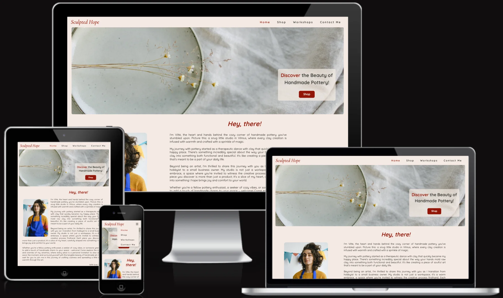
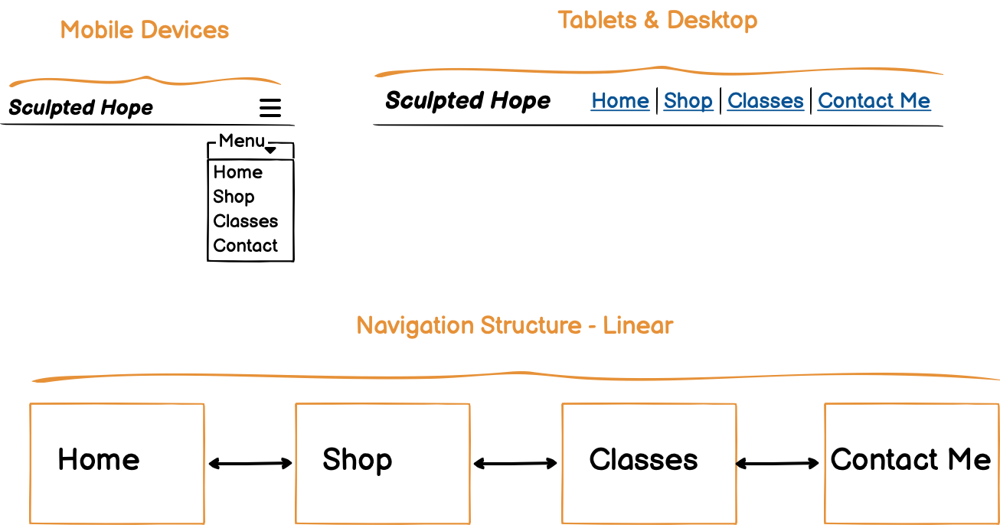
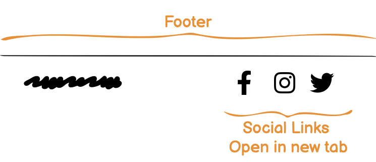
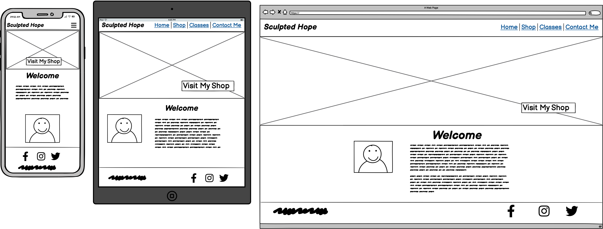
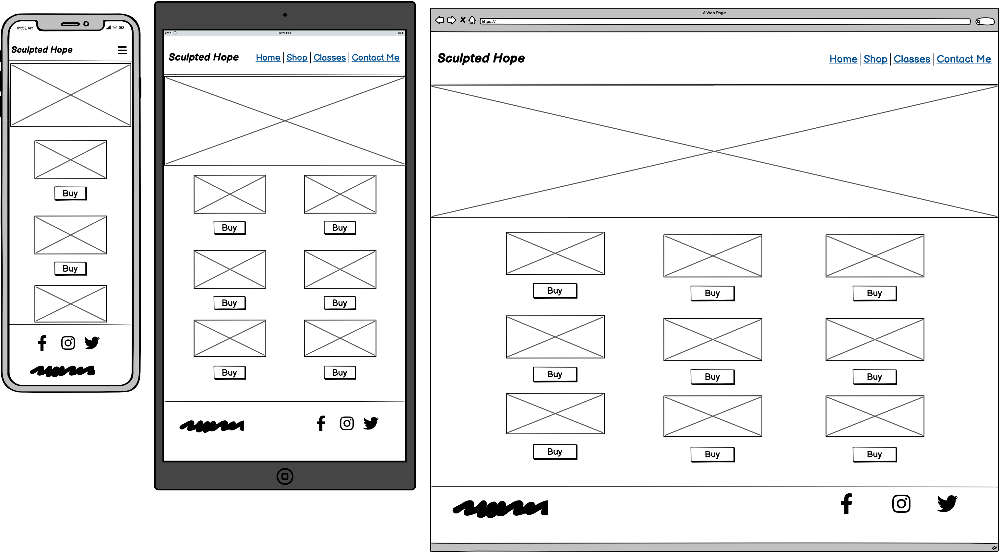
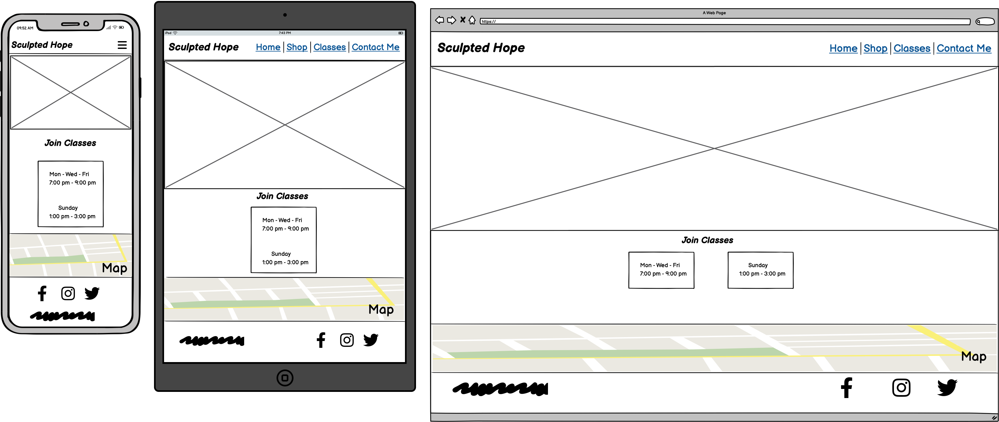
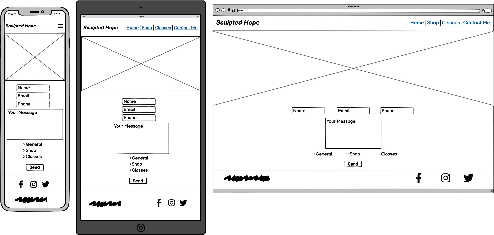
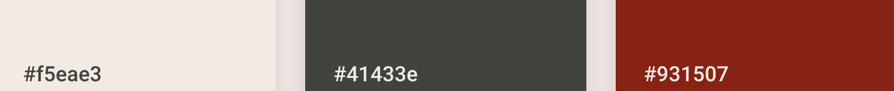

# Sculpted hope

Sculpted Hope is the website of a young artist who is progressing her hobby of pottery into her first business. For her little startup business, online presence is very important, as it is the most budget-friendly way of marketing and reaching a wider audience of like-minded people and customers. She wants to advertise her website on her business card, which she could hand out at art fairs, and promote her crafts through social media as well as friends and family. The artist would like to introduce herself and her works to visitors, allow them to purchase artworks they like, and invite them to join pottery classes at her small studio. 

**Link to live page: [Sculpted Hope](https://niekados.github.io/sculpted-hope/index.html)**

## Table Of Contents

- [Strategy](#strategy)
- [Targeted Audience](#targeted-audience)
- [User Stories](#user-stories)
- [Scope](#scope)
- [Structure](#structure)
    - [Navigation](#navigation)
    - [Footer](#footer)
    - [Home Page](#home-page)
    - [Shop Page](#shop-page)
    - [Workshop Page](#workshop-page)
    - [Contact Page](#contact-page)
    - [Contact Form Structure](#contact-form-structure)
- [Skeleton](#skeleton)
    - [Wireframes](#wireframes)
- [Surface](#surface)
    - [Fonts](#fonts)
    - [Colours](#colours)
- [Deployment](#deployment)
- [Technologies Used](#technologies-used)
- [Credits](#credits)
- [Testing and Validation](#testing-and-validation)

## Strategy

Develop a static website for the artist to have an online presence. Build a platform to promote, showcase, and sell her artwork. Inform visitors about available pottery classes,  and allow them to locate her studio by having a local map and address. Have social media links and a contact form allowing users to communicate with an artist about her work, classes, shopping queries, and possible collaborations.

## Targeted Audience

Art lovers of any age, home improvers, people attending art fairs, anyone looking for unique presents, like-minded artists, art event organizers, people who are following up after receiving an artist's business card, and social media users.

## User Stories

New users would like to:

- Find out more about the artist
- Explore her artworks
- Purchase artwork 
- Find information about available pottery classes 
- Contact the artist 
- Follow the artist on social media

Returning users would like to:

- Purchase artworks
- Check the days and times of pottery classes
- Find the address of her pottery studio before attending her classes
- Get in touch with an artist
- Check again the social links of an artist

## Scope

This project has budget limitations and to keep the lowest costs possible the website will be static, keeping development and maintenance expenses minimal. The artist would like to introduce herself to the users and a welcoming message on the first visit would fulfil the requirement, it would also give a personal touch and build a relationship with the visitor.  

Selling artwork is as important as building relations with users, for this reason, we will implement a web store page/section to list artworks available for purchase. The items in the store will be linked to the artist's Etsy store, further simplifying and reducing the costs of payment system management.

As an artist also runs pottery workshops, we will have a section/page with information about classes, to let the users know of available times and dates. Including a map will allow users to easily find the location of the studio if they decide to attend workshops.

Easy communication is an important part of the project and there will be a contact form available on the website, as well as social media links, allowing visitors to be in touch with the artist.

All pages will have images reflecting the theme of the section the user is currently visiting. Shop stores will have individual images for each store item. 

## Structure

The website will have 4 pages. Home page, Shop page, Workshops page, and Contact page. 

### Navigation

Page navigation- linear, with the same appearance on all the pages. Depending on your location on the site, the corresponding page name will be highlighted in the nav bar. The Navigation bar will be placed on top of the screen for easy and intuitive access. For mobile devices, it will collapse into a hamburger menu. For larger screens, it will be displayed in one line without the collapsed menu.

### Footer

- Mobile - Social Links will be centred on the top line of the footer, with developer copyright centred on the bottom line.   
- Tablet - Links and text displayed in one line. Copyright will be on the left side and Social links on the right side.
- Desktop - Links and text displayed in one line. Copyright will be on the left side and Social links on the right side.

### Home Page

- Mobile - Hero image welcomes the visitor with an image of pottery/ceramics and a call to action text with a Shop page link.  Bellow will be the artist's welcome message and her photograph with a short story of herself and her business. All will be presented in a column to allow for easy reading and scrolling on mobile devices.
- Tablet & Desktop - Hero image welcomes the visitor with an image of pottery/ceramics and a call to action text with a Shop page link. Bellow will be the artist's welcome message with her picture on the left and the story about her and her business on the right.  

### Shop Page

- Mobile - a different hero image at the top of the page representing the shop page. Pictures of artworks with a “Buy” button at the bottom are displayed in a single column. The “Buy” button will be linked to an external artist's Etsy web store.
- Tablet - The same layout as the mobile, but the artwork and buy buttons will be presented in two columns.
- Desktop - The same layout as the mobile, but the artwork and buy buttons will be presented in three columns.

### Workshop Page

- Mobile - a different hero image at the top of the page representing the workshop page. Bellow will be a call to action message to join classes/workshops and a “Join” button, followed by the schedule of the classes days and times broken down into weekdays and weekends. All are displayed in a single column. At the bottom of the page, the map will be placed to allow visitors to easily find the location of the studio.
- Tablet & Desktop - The same layout as the mobile, but times and dates are displayed in the same line for the weekdays and weekends, instead of a column.

### Contact Page

- Mobile & Tablet - The hero image on top of the page, visually represents that we are on the contact page, followed by the call to action message for getting in touch and a contact form displayed in a column.
- Desktop - The hero image on top of the page, visually represents that we are on the contact page, followed by the call to action message for getting in touch and a contact form. The desktop view will have Name, Email, and Phone Number input fields shown on the same line, and the Message box will go below it, with radio buttons under it for General, Shop, and Classes. The Send button will be placed at the very bottom.

### Contact Form Structure

- Name
- Email
- Message box
- Select Options:
    - General
    - Shop
    - Classes
- Send button

## Skeleton

### Wireframes

#### Home Page

#### Shop Page

#### Workshop page

#### Contact Page

## Surface
### Fonts
- __Cormorant Garamond *italic*__ - google font designed by Christian Thalmann is used for the logo.
- __Quicksand__ - google font Designed by Andrew Paglinawan is used for the main content and navigation links.

### Colours
The website colours were chosen to be light and earthy, not too distracting or harsh on the user's eyes. The artist picked a red logo, and that same red will be used for accents on the website to tie everything together. 
Colours were matched using the [Colour Contrast Checker](https://colourcontrast.cc/) to guarantee a minimum contrast index of 4.5.

- **#f5eae3** - A light, creamy colour with a subtle hint of pink reminiscent of clay, intended for use as the background.
- **#41433e** - An earthy, dark grey colour designated as the main font colour.
- **#931507** - A deep red colour was personally chosen by the artist for her logo, and it will also be used for buttons on the website.

## Deployment
This project was saved and stored on [GitHub](https://github.com/). GitHub has "git" version control and deployment through the GitHub Pages option.
To deploy your project to GitHub Pages:
- Go to your GitHub repository.
- Click on the "Settings" tab.
- Scroll down to the "Pages" section.
- Under the “Build and deployment” source drop-down menu select “Deploy from a branch”.
- Under the “Branch” drop-down menu, select “main” branch.
- Click "Save." (It may take a few minutes for the GitHub Pages to deploy).
- GitHub Pages will provide you with a link to your deployed website. The Deployed website address pattern is usually: "https://yourusername.github.io/your-repository/".

## Technologies Used
- CSS - Cascading Style Sheets is a style sheet language used for specifying the presentation and styling.
- HTML - HyperText Markup Language is a markup language that defines the content and structure of web content.
- (GitPod)[https://www.gitpod.io/] - cloud development environment. 
- [Balsamiq](https://balsamiq.com/) - low-fidelity wireframing tool.
- [Real Favicon Generator](https://realfavicongenerator.net/) - to generate Favicon from an image.
- [Google Fonts](https://fonts.google.com/) - used to add fonts to the logo, navigation links and main content.
- [Colour Contrast Checker](https://colourcontrast.cc/) - colour contrast checker for the background and fonts.
- [Formspree](https://formspree.io) - Formspree is a form backend, API, and email service for HTML & JavaScript forms. Used to handle contact page form submissions.

## Credits
- [UXWing](https://uxwing.com/ceramic-pottery-icon/) - used Ceramic Pottery Icon for Favicon, made available by [UXWing](https://uxwing.com/) under a free license.

### Images

- #### Home Page
    - [a-white-plate-with-some-flowers](https://unsplash.com/photos/a-white-plate-with-some-flowers-in-it-1ZYKRmTb2BE) - photo by [Kasia Sikorska](https://unsplash.com/@kasiasikorska).
    - [artist-image](https://www.pexels.com/photo/painter-standing-with-canvas-frame-in-workshop-5641957/) - photo by [Anna Shvets](https://www.pexels.com/@shvetsa/).

- #### Shop Page
    - [shopping-bags](https://unsplash.com/photos/red-and-gold-beaded-necklace-eD1RNYzzUxc) - photo by [Tamanna Rumee](https://unsplash.com/@tamanna_rumee).
    - [bottle-and-cups](https://unsplash.com/photos/two-white-ceramic-bowls-and-bottle-on-white-table-NLcLjLNUJbY) - photo by [Tom Crew](https://unsplash.com/@tomcrewceramics).
    - [milk-jugs](https://unsplash.com/photos/three-white-vases-on-table-iUFS1GCpEbk) - photo by [Tom Crew](https://unsplash.com/@tomcrewceramics).
    - [bowls](https://unsplash.com/photos/four-round-white-ceramic-bowls-on-white-surface-YA2E3d7a9Wo) - photo by [Tom Crew](https://unsplash.com/@tomcrewceramics).
    - [grey-containers](https://unsplash.com/photos/two-grey-containers-on-wooden-table-oiZAQvxTcYQ) - photo by [Tom Crew](https://unsplash.com/@tomcrewceramics).
    - [two-grey-canisters](https://unsplash.com/photos/two-gray-canisters-3uwu5K0RtaE) - photo by [Tom Crew](https://unsplash.com/@tomcrewceramics).
    - [white-ceramic-vase-on-white-table](https://unsplash.com/photos/white-ceramic-vase-on-white-table-uDF1mW7EUwM) - photo by [Tom Crew](https://unsplash.com/@tomcrewceramics).
    - [two-white-ceramic-bowls](https://unsplash.com/photos/two-white-ceramic-bowls-bgIO-u4GEfI) - photo by [Tom Crew](https://unsplash.com/@tomcrewceramics).
    - [two-empty-white-metal-cups](https://unsplash.com/photos/two-empty-white-metal-cups-vu0lyZYeseY) - photo by [Tom Crew](https://unsplash.com/@tomcrewceramics).
    - [five-round-white-ceramic-bowls-on-white-surface](https://unsplash.com/photos/five-round-white-ceramic-bowls-on-white-surface-SITGdvztUdg) - photo by [Tom Crew](https://unsplash.com/@tomcrewceramics).
    - [white-ceramic-mug-lot-on-white-surface](https://unsplash.com/photos/white-ceramic-mug-lot-on-white-surface-oHrC8V_XRU4) - photo by [Tom Crew](https://unsplash.com/@tomcrewceramics).
    - [white-ceramic-vase-lot](https://unsplash.com/photos/white-ceramic-vase-lot-JT3W6P1mYtU) - photo by [Tom Crew](https://unsplash.com/@tomcrewceramics).
    - [gray-ceramic-pot](https://unsplash.com/photos/gray-certamic-pot-E64Hv5Ab_nQ) - photo by [Tom Crew](https://unsplash.com/@tomcrewceramics).
    - [four-gray-jar-on-white-surface](https://unsplash.com/photos/four-gray-jar-on-white-surface-NUUjVj4YQLA) - photo by [Tom Crew](https://unsplash.com/@tomcrewceramics).
    - [couple-of-white-bowls-sitting-on-top-of-a-table](https://unsplash.com/photos/a-couple-of-white-bowls-sitting-on-top-of-a-table-t9sRlYIzfIQ) - photo by [Tom Crew](https://unsplash.com/@tomcrewceramics).
    - [gray-cup](https://unsplash.com/photos/gray-cup-XtyxEBiA8D8) - photo by [Tom Crew](https://unsplash.com/@tomcrewceramics).

- #### Workshops Page
    - [person-making-a-pot](https://www.pexels.com/photo/a-person-making-a-pot-14676586/) - photo by [Anastasia Lashkevich](https://www.pexels.com/@immortelleana/).

- #### Contact Page
    - [two-white-message-balloons](https://www.pexels.com/photo/two-white-message-balloons-1111368/) - photo by [Miguel Á. Padriñán](https://www.pexels.com/@padrinan/).

## Testing and Validation
Please follow **[this link](TESTING.md)** for Testing and Validation. 