# Testing and Validation

## HTML validation [The W3C Markup Validation Service](https://validator.w3.org/)

### index.html
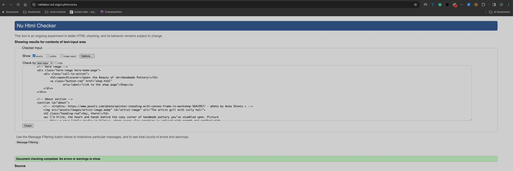

### shop.html
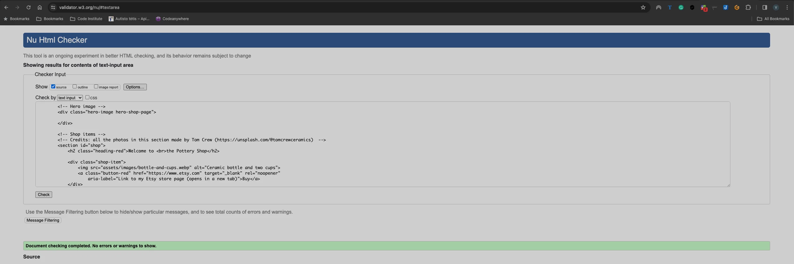

### workshops.html
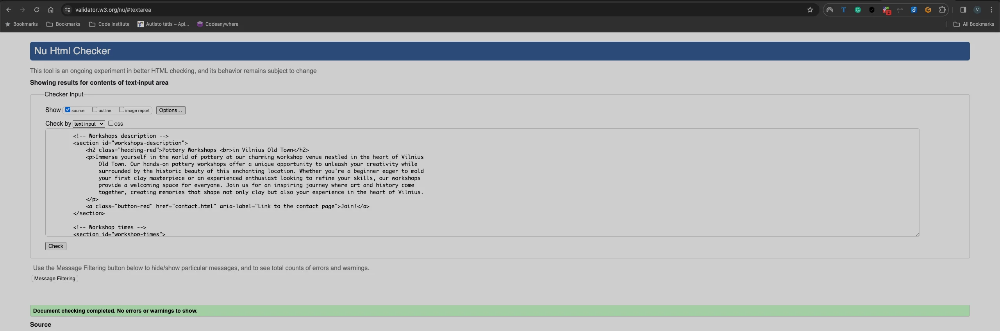

### contact.html
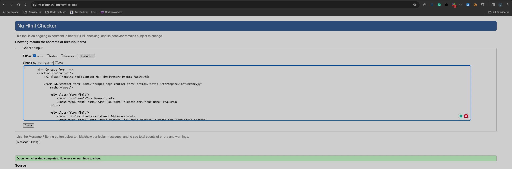

## CSS validation [The W3C CSS Validation Service - Jigsaw](https://jigsaw.w3.org/css-validator/)
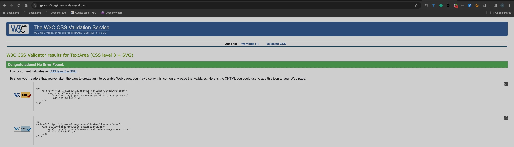

## Audits for performance, accessibility and progressive web apps [Google Lighthouse](https://developer.chrome.com/docs/lighthouse)

### Home Page

#### Desktop
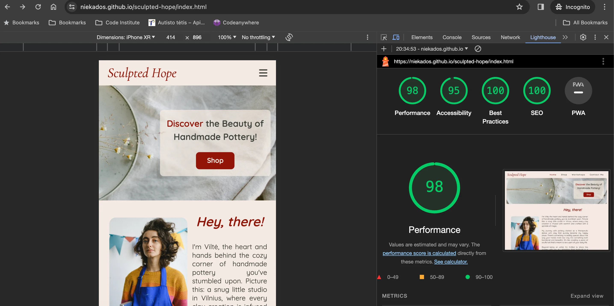

#### Mobile
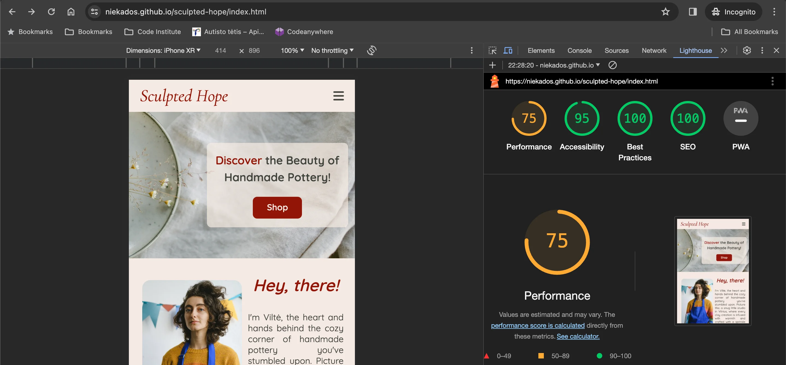

### Shop Page

#### Desktop
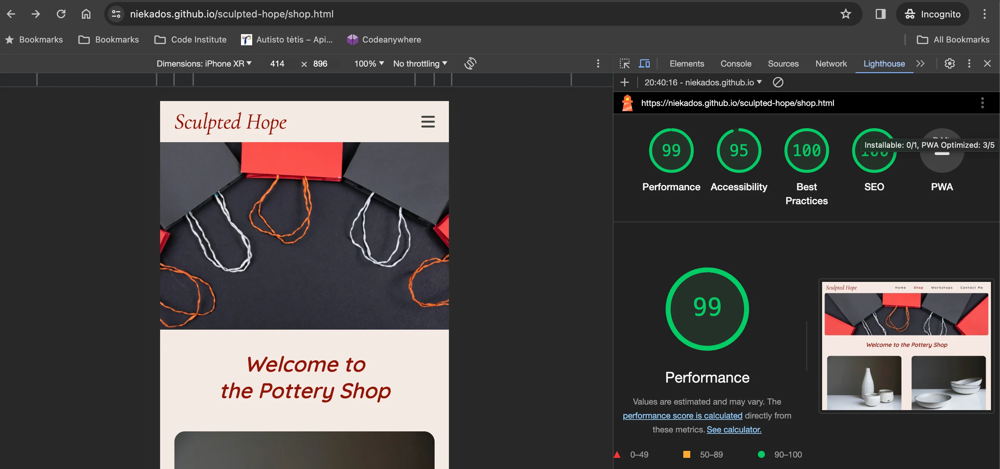

#### Mobile
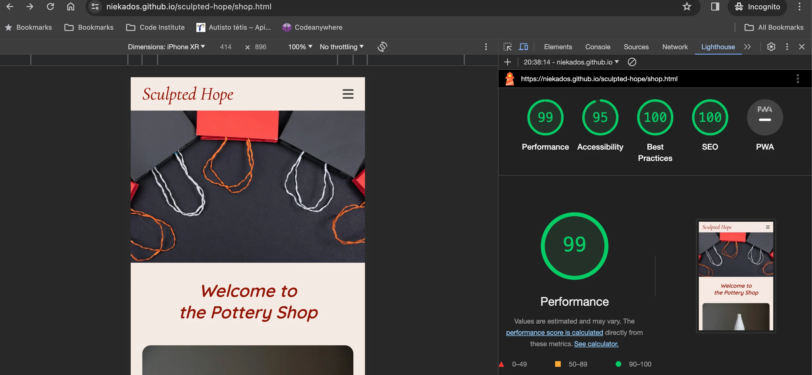

### Workshops Page

#### Desktop
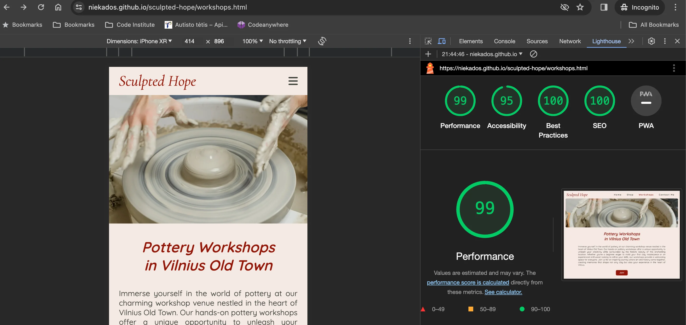

#### Mobile
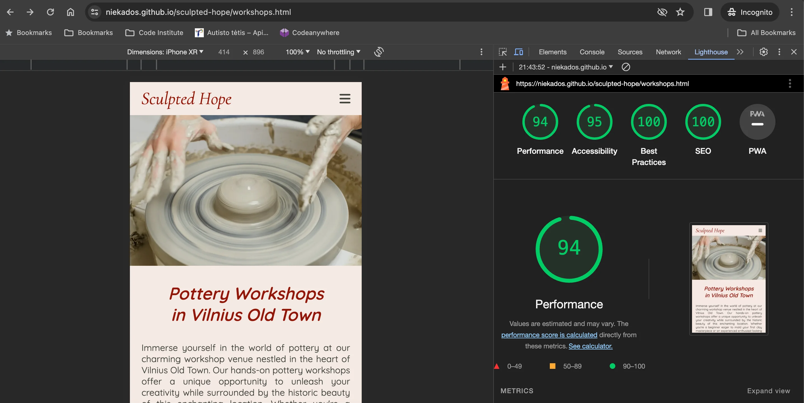

### Contact Page

#### Desktop
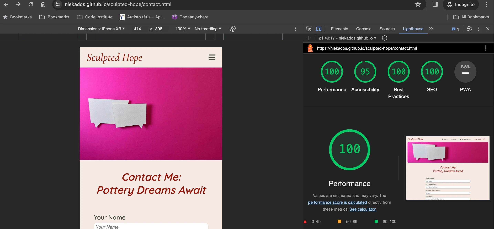

#### Mobile

## Website responsiveness [Am I Responsive](https://ui.dev/amiresponsive)

### Home Page 

### Shop Page
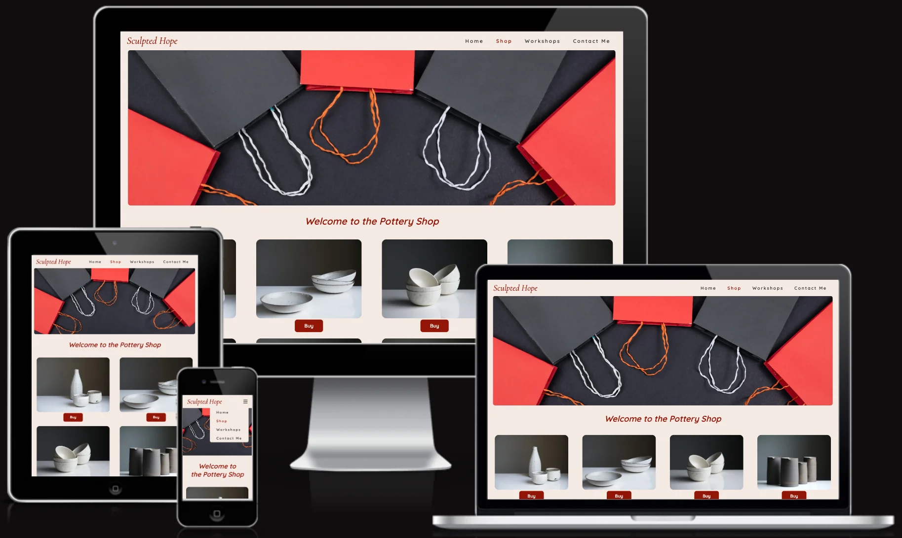

### Workshops Page
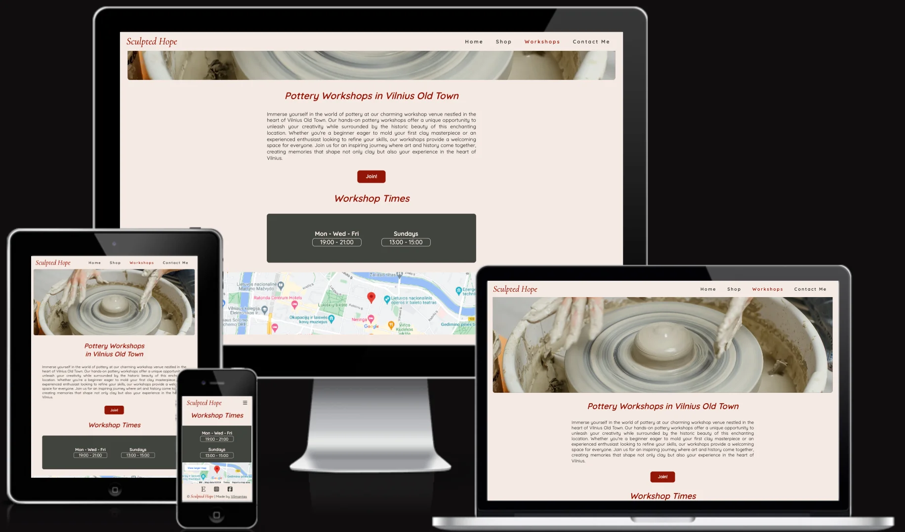

### Contact Page
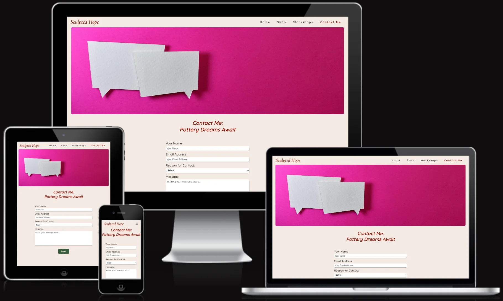