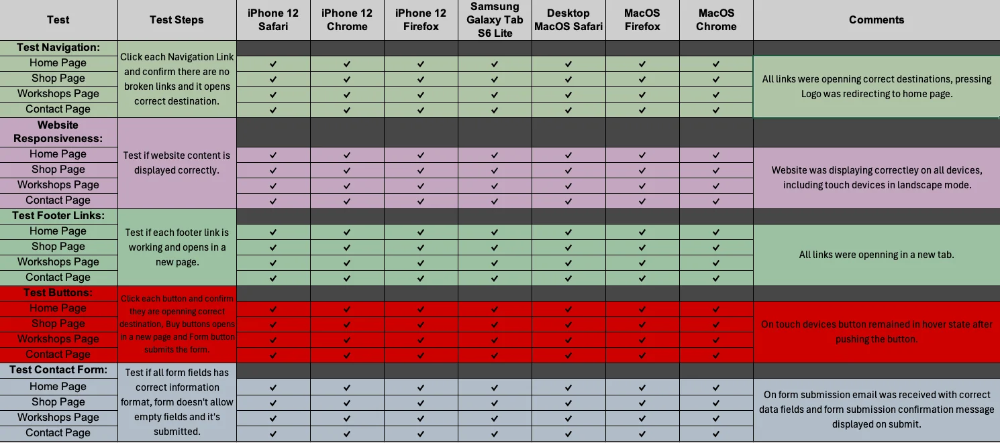
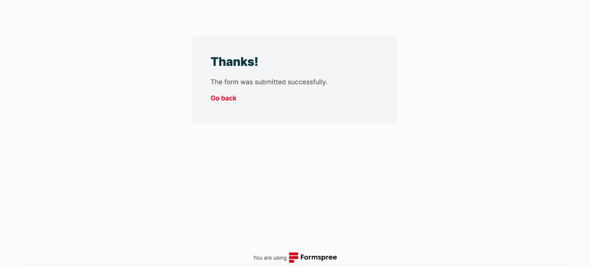
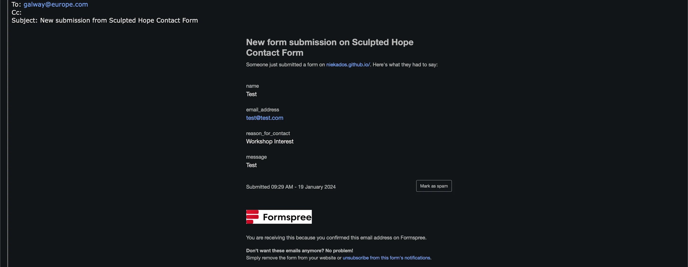

# Testing and Validation

## Table Of Contents

- [Testing](#testing)
- [Bugs](#bugs)
- [HTML validation](#html-validation-the-w3c-markup-validation-service)
- [CSS validation](#css-validation-the-w3c-css-validation-service---jigsaw)
- [Google Lighthouse - Audits for performance, accessibility and progressive web apps](#audits-for-performance-accessibility-and-progressive-web-apps-google-lighthouse)
- [Website responsiveness](#website-responsiveness-am-i-responsive)
- [Testing User Stories](#testing-user-stories)
- [Test Form Submission](#test-form-submission-formspree)

## Testing
The following steps were taken to test the website:

1. Test Navigation Links:
    - Click each navigation link (Home Page, Shop Page, Workshops Page, Contact Page) individually on iPhone 12, MacBook Air, and Samsung Galaxy Tab S6 Lite.
    - Verify for broken links and ensure each link opens the correct destination on Safari, Firefox, and Chrome browsers.
2. Test Website Content Display:
    - Visually inspect the website content on iPhone 12, MacBook Air, and Samsung Galaxy Tab S6 Lite using Safari, Firefox, and Chrome browsers.
    - Confirm that the website content is displayed correctly on all devices and browsers.
3. Test Footer Links:
    - Click each footer link (Home Page, Shop Page, Workshops Page, Contact Page) individually on iPhone 12, MacBook Air, and Samsung Galaxy Tab S6 Lite.
    - Confirm that each link works and opens in a new page on Safari, Firefox, and Chrome browsers.
4. Test Buttons:
    - Click each button individually on iPhone 12, MacBook Air, and Samsung Galaxy Tab S6 Lite.
    - Verify that buttons open the correct destination (Buy buttons open on a new page, and the Form button submits the form) on Safari, Firefox, and Chrome browsers.
5. Test Form:
    - Test all form fields for correct information format on iPhone 12, MacBook Air, and Samsung Galaxy Tab S6 Lite.
    - Ensure the form does not allow empty fields and successfully submit on Safari, Firefox, and Chrome browsers.
6. Confirm User Testing Details:
    - Confirm testing covered iPhone 12, MacBook Air, and Samsung Galaxy Tab S6 Lite devices.
    - Ensure testing encompassed Safari, Firefox, and Chrome browsers.

    

Test results are also available to download in the Excel sheet format **[here](assets/testing/testing.xlsx)**.

## Bugs

1. Issue: An anchor element cannot be embedded in a button element as per HTML convention.
Solution:

- Description: All buttons containing anchor elements were removed.
- Implementation: Buttons were replaced with anchor elements styled as buttons in CSS.
- Result: Ensures adherence to HTML conventions, allowing proper rendering and interaction.

2. Issue: On the deployed website, there was a visible gap between the header and main elements.
Solution:

- Description: The margin-top of the main element was causing the gap.
- Implementation: Replaced the margin-top with padding-top in the main element.
- Result: Eliminated the gap, providing a seamless visual transition between the header and main content.

3. Issue: On touch devices, after pressing a button, it remains in the hover state, causing a visual inconsistency.
Status:

- Description: The bug has not been fixed yet.
- Plan for Resolution:
    - Inspect the CSS styles related to button states on touch devices.
    - Adjust styles or add specific touch device styles to ensure proper visual feedback.
- Expected Result: After implementing the fix, buttons should no longer remain in the hover state on touch devices after being pressed.

## HTML validation [The W3C Markup Validation Service](https://validator.w3.org/)

### index.html

### shop.html

### workshops.html

### contact.html

## CSS validation [The W3C CSS Validation Service - Jigsaw](https://jigsaw.w3.org/css-validator/)

## Audits for performance, accessibility and progressive web apps [Google Lighthouse](https://developer.chrome.com/docs/lighthouse)

### Home Page

#### Desktop

#### Mobile

### Shop Page

#### Desktop

#### Mobile

### Workshops Page

#### Desktop

#### Mobile

### Contact Page

#### Desktop

#### Mobile

## Website responsiveness [Am I Responsive](https://ui.dev/amiresponsive)

### Home Page 

### Shop Page

### Workshops Page

### Contact Page

## Testing User Stories

New users would like to:

- Find out more about the artist

    - The user can find more about the artist on the home page.
    

- Explore her artworks
- Purchase artwork 
    - The user can browse the shop gallery with the artwork imagery and can easily purchase them with the buy button.
    

- Find information about available pottery classes 
    - The information and workshop schedule is available on the workshops page.
    

- Contact the artist 
    - The Contact Me form is available on the Contact page if the user wants to get in touch with the artist.
    

- Follow the artist on social media
    - Social media links are available on each page footer.
    

Returning users would like to:

- Purchase artworks
    - The user can browse the shop gallery with the artwork imagery and can easily purchase them with the buy button.
    

- Check the days and times of pottery classes
    - The information and workshop schedule is available on the workshops page.
    

- Find the address of her pottery studio before attending her classes
    - An Interactive Google Maps section is available on the Workshops page.
    

- Get in touch with an artist
    - The Contact Me form is available on the Contact page if the user wants to get in touch with the artist.
    

- Check again the social links of an artist
    - Social media links are available on each page footer.
    

## Test Form Submission [Formspree](https://formspree.io/)

- Form submission confirmation
    

- Form data delivered to the email
    