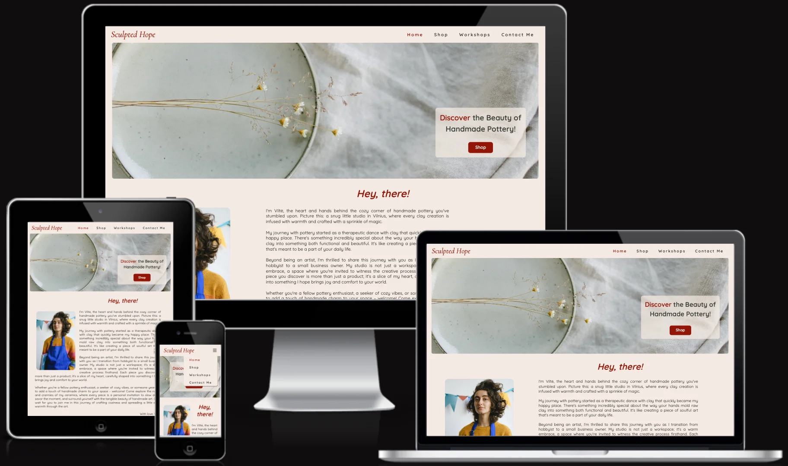

# Testing and Validation

## HTML validation [The W3C Markup Validation Service](https://validator.w3.org/)

### index.html

### shop.html

### workshops.html

### contact.html

## CSS validation [The W3C CSS Validation Service - Jigsaw](https://jigsaw.w3.org/css-validator/)

## Audits for performance, accessibility and progressive web apps [Google Lighthouse](https://developer.chrome.com/docs/lighthouse)

### Home Page

#### Desktop

#### Mobile

### Shop Page

#### Desktop

#### Mobile

### Workshops Page

#### Desktop

#### Mobile

### Contact Page

#### Desktop

#### Mobile

## Website responsiveness [Am I Responsive](https://ui.dev/amiresponsive)

### Home Page 

### Shop Page

### Workshops Page

### Contact Page

## Testing User Stories

New users would like to:

- Find out more about the artist

    - The user can find more about the artist on the home page.
    

- Explore her artworks
- Purchase artwork 
    - The user can browse the shop gallery with the artwork imagery and can easily purchase them with the buy button.
    

- Find information about available pottery classes 
    - The information and workshop schedule is available on the workshops page.
    

- Contact the artist 
    - The Contact Me form is available on the Contact page if the user wants to get in touch with the artist.
    

- Follow the artist on social media
    - Social media links are available on each page footer.
    

Returning users would like to:

- Purchase artworks
    - The user can browse the shop gallery with the artwork imagery and can easily purchase them with the buy button.
    

- Check the days and times of pottery classes
    - The information and workshop schedule is available on the workshops page.
    

- Find the address of her pottery studio before attending her classes
    - An Interactive Google Maps section is available on the Workshops page.
    

- Get in touch with an artist
    - The Contact Me form is available on the Contact page if the user wants to get in touch with the artist.
    

- Check again the social links of an artist
    - Social media links are available on each page footer.
    